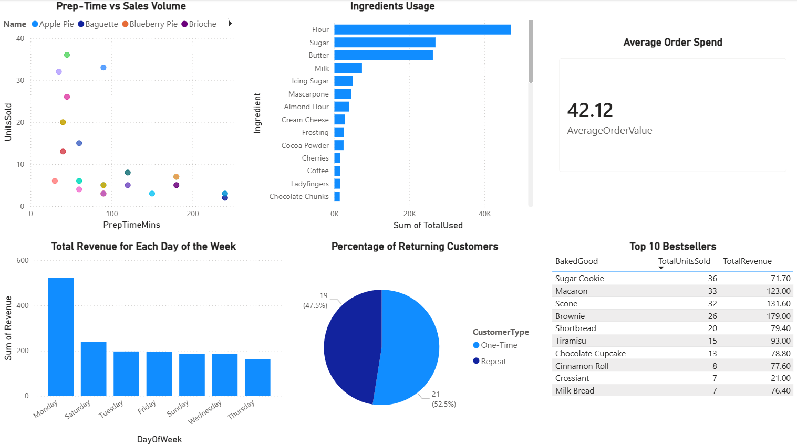

# Bakery Sales and Inventory Data Analysis

## Overview
This project analyses inventory and sales data of a bakery using data from a database I designed. The goal is to generate data that can be used in data visualisation and calculate metrics that can be used in general KPI reporting. 

This project demonstrates SQL data validation, multi-table joins, aggregations, grouping, and ranking to extract actionable insights from a bakery dataset, including daily revenue trends, best-selling baked goods, average order value, customer behaviour, product preparation efficiency, and ingredient usage.

---

## Dataset
* **Source:** Self designed and generated dataset
* **No personal information of real individuals are used, and any similarities are due to coincidence. Personal data such as names have been randomly generated.**
* **Contents:**
  - 'baked_good': bakery products
  - 'customer': customer details
  - 'ingredient': ingredients used by bakery
  - 'orders': order details
  - 'recipe': details on the quantities of ingredients needed to make each bakery product
* **Format:** CSV

---

## Project Goals
* To **calculate**  the **total revenue for each day of the week** to identify peak days with the most business. This was done instead of finding revenue of every day to generate seasonal data that can allow one to identify trends and growth due to the limitations of small dataset size.
* To **identify** which products are the most popular** and drive marketing decisions. Top selling products are identified using quantity sold not revenue as higher price per unit on a product can skew this metric
* To **generate metrics**  which can be used in KPIs such as the **average spend per order**
* To **generate data** to be used to calculate **percentage of repeat customers**
* To **compare** time taken to produce products **vs** how well it's selling, this helps identified if too much time has been taken to make products with lower sales.
* To **identify** which ingredients are being used the most

---

## Skills Demonstrated
* SQL **JOINs** across multiple tables (`orders`, `baked_good`, `recipe`, `ingredient`, `customer`)  
* Aggregating and analysing data with `SUM`, `AVG`, and `COUNT`  
* Grouping and categorising data with `GROUP BY` and conditional logic (`CASE`)  
* Ranking and filtering results using `ORDER BY` and `LIMIT`  
* Performing data validation and schema inspection using `PRAGMA`  
* Extracting actionable business insights, including revenue trends, top-selling products, average customer spend, and ingredient usage  
* Writing **clear, well-commented SQL queries** suitable for reporting and visualisation
* Analysing query results in **Power BI** to create interactive dashboards and charts for business insights

---

## Key Findings
* **Total daily revenue ** shows that Monday generated the highest total revenue, highlighting peak sales at the start of the week.  
  - This insight can guide staffing, production planning, and promotional efforts for high-demand days.  
* **Top-selling baked goods** reveal that **Sugar Cookies** had the highest quantity sold, indicating customer preferences and best-performing products.  
  - Charts of top products can be used in dashboards to highlight sales distribution, marketing choices and guide inventory decisions.  
* **Average order spend** is **$42.12**, providing a benchmark for customer spending behaviour.  
  - This metric can then be tracked over time or segmented by product/category to identify opportunities for upselling or promotions.  
* **Customer retention** shows that **52.5 %** of customers are returning, helping assess loyalty and the effectiveness of engagement strategies.  
  - Visualising one-time vs. repeat customers can guide marketing campaigns and loyalty programs.  
* **Ingredient usage** analysis highlights **flour** as the most used ingredient, indicating high production volume and potential for inventory monitoring.  
  - Insights on ingredient consumption can be linked to sales trends to optimise stock levels and reduce waste.
* **Products that fall below a certain threshold by requiring intensive preparation time but have low sales volume can then go through cost benefit analysis to determine if it should be discontinued.

---

## Dashboard

See screenshot of dashboard generated from Power BI using the bakery data that summarise the findings.

---

## Files
* 'bakery_analysis.sql': SQL queries with comments
* Datasets generated by author
* Screenshot of dashboard created in Power BI

---

## How to Use
* Import the UKHSA CSV datasets into SQLite or a compatible SQL environment. If using MySQL, remove PRAGMA clauses.
* Run the SQL queries in 'bakery_analysis.sql'
* Review query results to explore findings.
* Optionally, use the results to create charts and dashboards

---

## Conclusion
This analysis demonstrates how SQL can reveal key insights from bakery sales and operations data. It highlights revenue trends, top-selling products, average order values, returning customer behaviour, and ingredient usage. These findings can guide business decisions such as inventory management, staffing, and promotions, while Power BI dashboards provide a clear visual summary of performance.